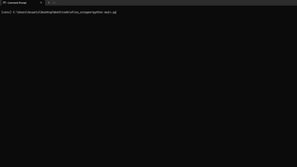

# OFCRA SCRAPER
CLI tool written in Python that scrapes the latest missions from the [official OFCRA stats page](https://aar.ofcra.org/stats/missions.php) and exports structured data (missions + players) to JSON for further analysis.<br>



For those who might not know: OFCRA is an ARMA 3 community that makes TVT missions almost every week, they upload their statistics to their official website.<br>

<br>

## Features
- Extracts all mission details (name, map, date...)
- Extracts all players for each mission along their stats (kills, shots, role...)
- Lets you export retrieved data to JSON

## Architecture
1. Scrape missions list
2. Store missions in array
3. Scrape players for each mission
4. Export final dataset to JSON

## Installation
Clone or download the repo and run the following command to install external libraries from the project directory: <br>
```cmd
pip install -r requirements.txt
```
Then run this command for the scraping library: <br>
```cmd
playwright install
```
Run the script with: <br>
```cmd
python main.py
```

## Why I made this
I've been learning web scraping with Python lately, I've done some programs using ScrapeGraphAI and Scrapy. I wanted to try something as simple and popular as Playwright too, but also wanted to create something useful out of it that everyone can use! Not only is this a learning project, but also a useful tool for you to use whenever you want!
